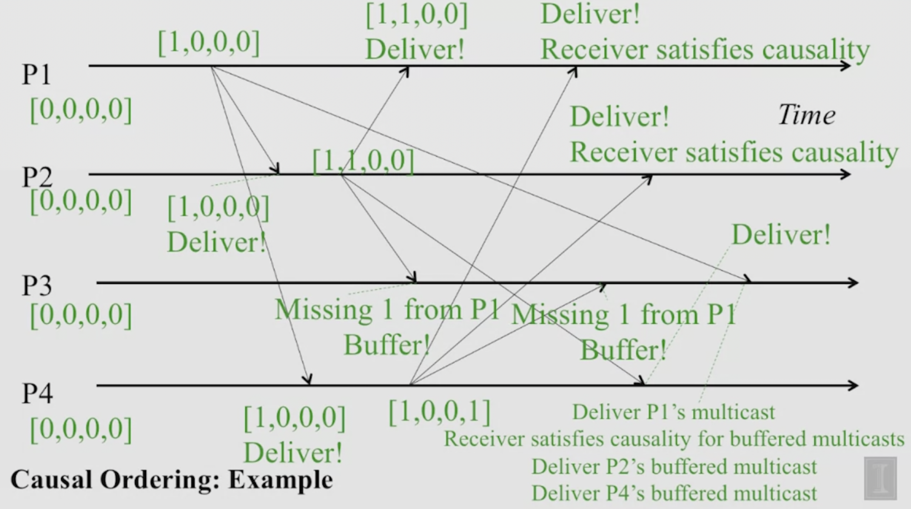

# Causal Ordering in Multicast
- Multicasts whose send events are causally related, must be received in the same causality-obeying order at all receivers.
- In summary, if multicast(g,m) -> multicast(g,m_prime), then any correct process that sends m_prime would already have sent m (`->` Lamport happens-before).

## Example:

