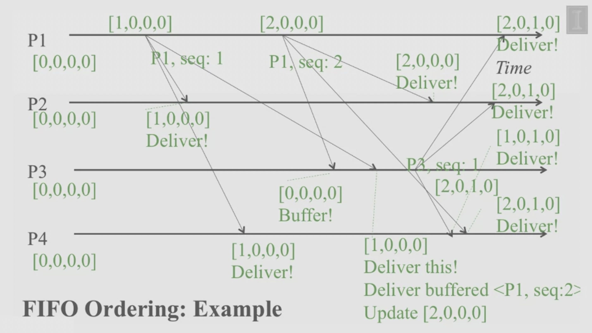

# FIFO Ordering in Multicast
- Multicasts from each sender are received in the order they are sent, at all receivers.
- Do not need to worry about multicasts from different senders.
- It may buffer a received multicast message until FIFO ordering is satisfied.
- In summary, if a correct process issues (sends) multicast(g, m) to a group g and then multicast(g, m_prime). Then every correct process that delivers m_prime would already have delivered m.

## Example:

