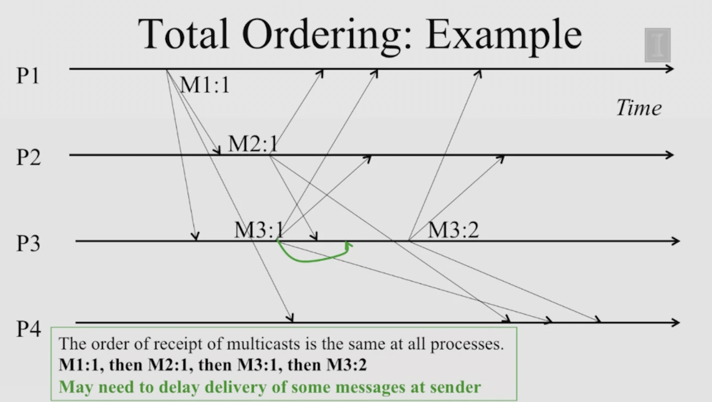
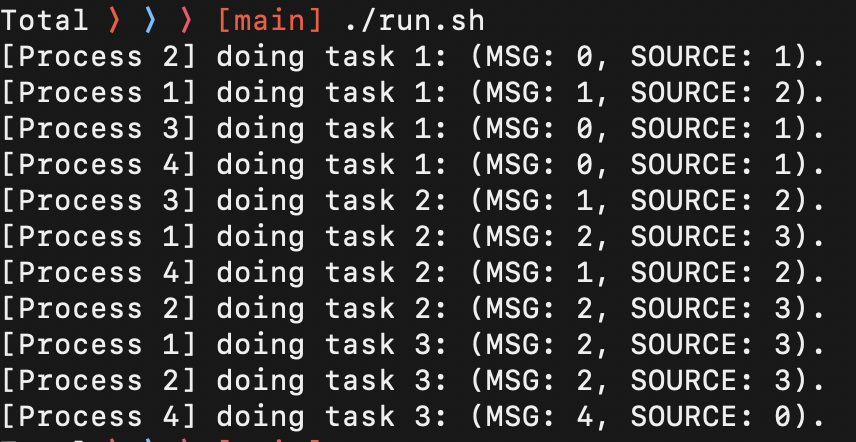

# Total Ordering (Atomic Broadcast) in Multicast
- Do not pay attention to order of multicast sending.
- Ensure all receivers receive all multicasts in the same order.
- In summary, if a correct process P sends message m before m_prime (independent of the senders), then any other correct process P_prime that sends m_prime would already have sent m.
- Sequencer based approach.

## NOTES
- The implementation does not handle msg remaining inside the buffer after all the point to point communications completed. However, it should follow the rules of Total Ordering. All the tasks for each process should follow a non decreasing order.
- I'm open to a pull request!

## Example:
- Communication:__

- Log result:__

